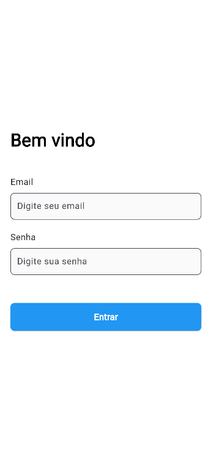
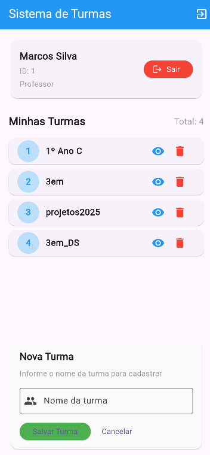
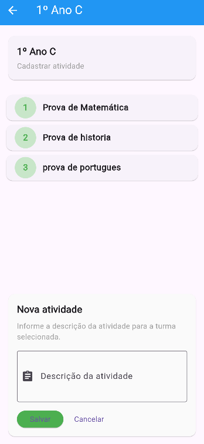

# Sistema de Gestão Escolar - Mobile

## 📱 Tecnologias Utilizadas

- **Flutter** - Framework para desenvolvimento mobile
- **Dart** - Linguagem de programação
- **HTTP** - Cliente para consumo de APIs REST
- **Shared Preferences** - Armazenamento local de dados
- **Material Design** - Sistema de design do Flutter

## 📸 Screenshots das Telas

### Tela de Login

**Características:**
- Formulário de email e senha
- Validação de campos
- Feedback visual de carregamento
- Tratamento de erros de autenticação

### Tela Principal - Lista de Turmas

**Funcionalidades:**
- Header com informações do professor
- Lista de turmas com contador
- Botão para cadastrar nova turma
- Ações: Visualizar e Excluir turmas
- Refresh indicator para atualizar lista

### Tela de Atividades da Turma

**Funcionalidades:**
- Header com nome da turma
- Lista numerada de atividades
- Botão para cadastrar nova atividade
- Formulário inline para cadastro
- Tratamento de lista vazia

## 🔧 Funcionalidades Implementadas

### Autenticação
- Login com email e senha
- Persistência de sessão com Shared Preferences
- Logout com limpeza de dados locais

### Gestão de Turmas
- Listagem de turmas por professor
- Cadastro de novas turmas
- Exclusão de turmas (com restrição para turmas com atividades)
- Navegação para tela de atividades

### Gestão de Atividades
- Listagem de atividades por turma
- Cadastro de novas atividades
- Interface intuitiva para turmas sem atividades

### Tratamento de Erros
- Mensagens amigáveis para erros de rede
- Tratamento específico para turmas com atividades
- Feedback visual durante operações assíncronas

## 🚀 Como Executar

1. Certifique-se de ter o Flutter instalado
2. Clone o repositório
3. Execute `flutter pub get` para instalar as dependências
4. Execute `flutter run` para iniciar o aplicativo

## 📱 Requisitos

- Flutter 3.0+
- Dart 2.17+
- Dispositivo ou emulador Android/iOS
- Backend API rodando em `http://localhost:3001`

---

*Desenvolvido com Flutter para sistema de gestão escolar*